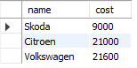
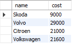
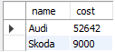
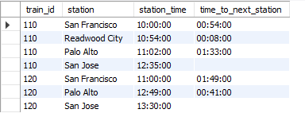
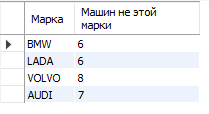

# Cоздайте представление, в которое попадут автомобили стоимостью  до 25 000 долларов

    CREATE OR REPLACE VIEW auto_max_25 AS
    SELECT name, cost
    FROM auto
    WHERE cost < 25000;

    SELECT * FROM auto_max_25;

# Изменить в существующем представлении порог для стоимости: пусть цена будет до 30 000 долларов (используя оператор ALTER VIEW) 

    ALTER VIEW auto_max_25 AS
    SELECT name, cost
    FROM auto
    WHERE cost < 30000;

    SELECT * FROM auto_max_25;

# Создайте представление, в котором будут только автомобили марки “Шкода” и “Ауди”

    CREATE OR REPLACE VIEW audi_skoda AS
    SELECT name, cost
    FROM auto
    WHERE name IN("Audi ", "Skoda ");

    SELECT * FROM audi_skoda;

# Добавьте новый столбец под названием «время до следующей станции»

    SELECT 
	train_id,
    station,
    station_time,
	IF (SUBTIME(LEAD (station_time, 1) OVER (PARTITION BY train_id), station_time) IS NULL, " ", 
        SUBTIME(LEAD (station_time, 1) OVER (PARTITION BY train_id), station_time)) 
	AS "time_to_next_station"
    FROM train;

# (Задание из предыдущего семенара) Вывести на экран марку авто и количество AUTO не этой марки

    SELECT 
	b.m AS "Марка",
	a.col - b.col AS "Машин не этой марки"
    FROM
	    (SELECT COUNT(*) col FROM auto) a,
        (SELECT COUNT(*) col, mark m FROM auto GROUP BY mark) b;
